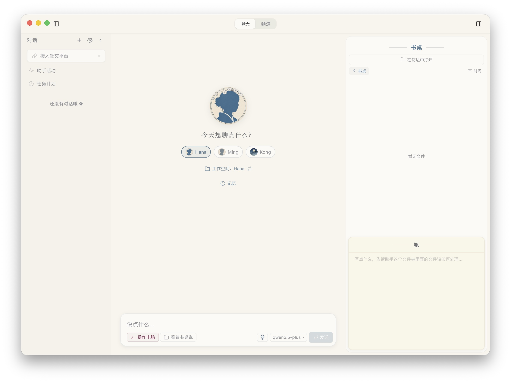

<p align="center">
  
</p>

<p align="center">
  
</p>

<h1 align="center">OpenHanako</h1>

<p align="center">一个有记忆、有灵魂的私人 AI 助理</p>

<p align="center"><a href="README_EN.md">English</a></p>

[](LICENSE)
[](https://github.com/liliMozi/openhanako/releases)

---

## Hanako 是什么

OpenHanako 是一个更加易用的 AI agent，有记忆，有性格，会主动行动，还能多 Agent 在你的电脑上一同工作。

作为助手，Ta 是温柔的：不需要写复杂的配置，不需要理解晦涩的术语。Hanako 它不只面向 coder ，而是为每一个坐在电脑前工作的人设计的助手。
作为工具，Ta 是强大的：记住你说过的每一件事，操作你的电脑，浏览网页，搜索信息，读写文件，执行代码，管理日程，还能自主学习新技能。

我开这个项目的初衷是：弥合绝大多数人和 AI Agent 之间的缝隙，让强大的 Agent 能力不再只局限于命令行里。于是我做了比传统 Coding Agent 更多一些的优化：一方面是强化 Agent「像人」的属性，是你和他们沟通更自然；另一方面，因为我本职也是一介文员，所以我也针对日常办公场景做了很多工具性和流程性的优化，敬请探索。
此外，Hanako 有比较完备的图形页面。

如果你用过 claude code、codex、Manus 等 CLI 或是图形化的 Agent，你会在 Hanako 这里找到熟悉又新奇的感觉。

## 功能特性

**记忆** — 结合主流的记忆方案，自己又发挥了一下，做了个记忆系统，近期的事情记得非常牢固，但目前确实有待优化。

**人格** — 不是千篇一律的"AI 助手"。通过人格模板和自定义人格文件塑造独特的性格，每个 Agent 都有自己的说话方式和行为逻辑，Agent 之间分离做得很好，备份方便，Agent 就是文件夹，后续还会添加备份功能。

**工具** — 读写文件、执行一次性命令或持续终端会话、浏览网页、通过浏览器后端或 API 搜索互联网、截图、分段长截图、媒体预览、检查网页。能力覆盖日常办公的绝大多数场景。也可以通过 server-first CLI 连接同一个 Hana Server，在终端里查看状态、列会话和继续对话。

**SKILLS 支持** — 内置兼容庞大 SKILLS 社区生态，之外，我也做了一些主动的优化：有时候干活之前，Agent 会从 GitHub 安装社区技能，Agent 也可以自己编写并学会新技能，有比较不错的主动性。当然，默认情况给 Agent 做了比较严格的 SKILLS 审核，如果发现 SKILLS 装不上可以自行关闭。

**角色卡与技能包** — Agent 可以导入 / 导出为本地优先的角色卡 zip，按白名单携带人格、头像、可选记忆和 Skills。Skill Bundle 是独立的技能包基础设施，可以在技能管理页分组、拖拽、成组启用，并单独导出为 zip，方便迁移和分享。

**多 Agent** — 创建多个 Agent，各自有独立的记忆、人格和定时任务。Agent 之间可以通过频道群聊协作，也可以互相委派任务。

**书桌** — 每个 Agent 都有自己的书桌，可以放文件、写笺（类似便签，Agent 会主动读取并执行）。支持拖拽操作、文件预览和工作区文件树变更监听，是你和 Agent 之间的异步协作空间。

**全屏媒体查看器** — 聊天里或书桌上的任意图片、SVG、视频，点开就是暗色遮罩的全屏预览：滚轮缩放、拖拽平移，`+` / `−` / `0` 键盘快捷，左右箭头在同会话或同目录的相邻媒体间切换。

**会话管理** — 侧栏支持聊天记录搜索，标题命中优先，必要时继续检索正文；旧会话可以归档后从设置入口恢复或永久删除。聊天正文里的选中文本会进入输入框引用卡片，继续追问时保留原文语境。

**定时任务与心跳** — Agent 可以设置定时任务（Cron），也会定期巡检书桌上的文件变化。当前自动化执行器已经把“什么时候触发”和“做什么”拆开：复杂任务仍让 Agent 后台执行，轻量提醒可以直接发送通知，插件动作也可以被计划调用。

**安全沙盒** — 双层隔离：应用层 PathGuard 四级访问控制 + 操作系统级沙盒（macOS Seatbelt / Linux Bubblewrap / Windows restricted token）。Agent 的权限在你的掌控之中。平时可只读访问系统普通文件，写入和删除限制在工作目录与受控数据目录。Windows 命令沙盒目前是写隔离模型：读取按当前用户权限自然发生，网络也按当前用户网络权限运行；macOS / Linux 的网络隔离仍由对应平台沙盒能力决定。如果你想调整权限，可以在设置 → 安全页面修改沙盒级别；外部网络也可以配置系统代理、手动代理或直连。

**插件系统** — 约定优先的可扩展插件架构。拖拽安装社区插件，插件可以贡献工具、技能、命令、Agent 模板、HTTP 路由、事件钩子、LLM Provider、页面、侧栏 Widget、配置 schema 和后台任务。路由可直接访问核心服务（PluginContext 注入），通过 Session Bus 与 Agent 对话、获取历史、管理 session。两级权限模型（restricted / full-access）保障安全。

**多平台接入** — 同一个 Agent 可以同时接入 Telegram、飞书、QQ、微信机器人，在任何平台和 Ta 对话，可以远程操作电脑；Bridge 消息会带平台上下文，通知也可以回发到当前外部平台。

**移动端与 LAN 前端** — Hana Server 可以托管 `/mobile/` PWA，手机通过设备访问密钥或本地账号登录，查看会话、继续聊天和管理工作台文件。另一台桌面端也可以通过 LAN URL + access key 连接到已有 Hana Server，继续消费同一套会话和资源。

**国际化** — 界面支持中文、英文、日文、韩文、繁体中文 5 种语言。

## 截图

<p align="center">
  
</p>

## 快速开始

### 下载安装

**macOS（Apple Silicon / Intel）**：从 [Releases](https://github.com/liliMozi/openhanako/releases) 下载最新 `.dmg`。

应用已通过 Apple Developer ID 签名和公证，macOS 应该可以直接打开。

**Windows**：从 [Releases](https://github.com/liliMozi/openhanako/releases) 下载最新 `.exe` 安装包。

> **Windows SmartScreen 提示：** 安装包暂未经过代码签名，首次运行时 Windows Defender SmartScreen 可能会拦截，点击**更多信息** → **仍要运行**即可，未签名版本的正常现象。

**Linux**：从 [Releases](https://github.com/liliMozi/openhanako/releases) 下载最新 `.AppImage` 或 `.deb`。

### 首次运行

首次启动时，引导向导会带你完成配置：选择语言、输入你的名字、连接模型提供商（API key + base URL），并选择三个模型：**对话模型**（主对话）、**小工具模型**（轻量任务）、**大工具模型**（记忆编译和深度分析）。设置页还可以单独选择**视觉模型**，让文本模型通过 Vision Bridge 处理图片附件。Hanako 支持 OpenAI 兼容、Anthropic 风格、OAuth Provider 和 Ollama 本地模型等多类接入。
目前也添加了 OpenAI 的 OAuth 登录，鉴于 Anthropic 会有封号风险，所以暂时不提供。

## 架构

```
core/           引擎编排层 + Manager（含 PluginManager）
lib/            核心库（记忆、工具、沙盒、Bridge 适配器）
server/         Hono HTTP + WebSocket 服务（独立 Node.js 进程）
hub/            调度器、频道路由、事件总线
desktop/        Electron 应用 + React 前端
shared/         跨层共享工具（config schema、error bus、模型引用等）
plugins/        内置系统插件（随应用打包）
skills2set/     内置技能定义
scripts/        构建工具（server 打包、启动器、签名）
tests/          Vitest 测试
```

引擎层协调多个 Manager（Agent、Session、Model、Preferences、Skill、Channel、BridgeSession、Plugin 等），通过统一的 facade 暴露。Hub 负责后台任务（心跳巡检、自动化 / 定时任务、频道路由、Agent 间通信、DM 路由），独立于当前聊天会话运行。

Session 内的用户可见文件通过 `SessionFile` sidecar 统一登记，桌面端、Bridge、Mobile PWA 和其它远程前端按各自能力消费同一份文件身份。Bridge 平台媒体发送规则见 `.docs/BRIDGE-MEDIA-CAPABILITIES.md`，插件文件贡献规则见 `PLUGINS.md`。

本机 staged 文件优先由各平台 adapter 直接上传：Telegram / 飞书 / 微信走各自上传接口，QQ 走官方 Bot 分片上传接口，再发送 `msg_type: 7` 富媒体消息。`preferences.bridge.mediaPublicBaseUrl` / `HANA_BRIDGE_PUBLIC_BASE_URL` 只用于仍需公网 URL 的平台或远程 fallback；该 URL 作为 `/api/bridge/media/:token` 临时文件路由的 origin，文件本身仍由短期 token、下载次数和本地路径白名单保护。Hana 不会自动开启公网 tunnel，公网入口必须由用户显式提供。

Server 以独立 Node.js 进程运行（由 Electron spawn 或独立启动），通过 Vite 打包，@vercel/nft 追踪依赖。与 Electron 渲染进程通过 WebSocket 通信。
用户数据目录由 `HANA_HOME` 决定（生产默认 `~/.hanako`，开发默认 `~/.hanako-dev`）。Pi SDK 自己的数据隔离在 `${HANA_HOME}/.pi/` 下。

## 技术栈

| 层级 | 技术 |
|------|------|
| 桌面端 | Electron 38 |
| 前端 | React 19 + Zustand 5 + CSS Modules |
| 构建 | Vite 7 |
| 服务端 | Hono + @hono/node-server |
| Agent 运行时 | [Pi SDK](https://github.com/earendil-works/pi) |
| 数据库 | better-sqlite3（WAL 模式） |
| 测试 | Vitest |
| 国际化 | 5 语言（zh / en / ja / ko / zh-TW） |

## 平台支持

| 平台 | 状态 |
|------|------|
| macOS (Apple Silicon) | 已支持（已签名公证） |
| macOS (Intel) | 已支持 |
| Windows | Beta |
| Linux | 已支持（AppImage / deb） |
| 移动端 (PWA) | v0：同一 Hana server 的手机会话与工作台访问 |

## 开发

```bash
# 安装依赖
npm install

# Electron 启动（自动构建 renderer）
npm start

# Vite HMR 开发（需先运行 npm run dev:renderer）
npm run start:vite

# 仅启动 server
npm run server

# server-first CLI
npm run cli

# 运行测试
npm test

# 类型检查
npm run typecheck
```

## 许可证

[Apache License 2.0](LICENSE)

## 链接

- [官网](https://openhanako.com)
- [提交 Issue](https://github.com/liliMozi/openhanako/issues)
- [安全页](https://github.com/liliMozi/openhanako/security)
- [安全政策](SECURITY.md)
- [插件开发指南](PLUGINS.md)
- [贡献指南](CONTRIBUTING.md)
